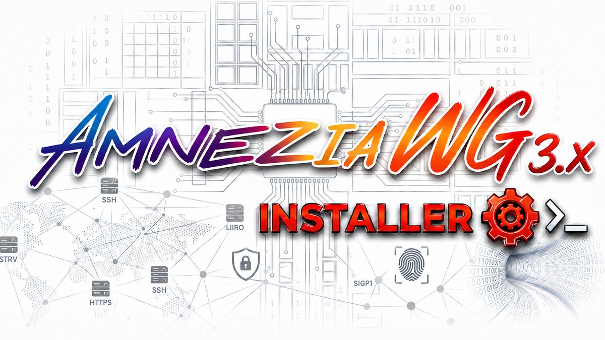

<a id="top"></a>
<p align="center">
  <b>RU</b> Русский | <b>EN</b> <a href="README.en.md">English</a>
</p>

<p align="center">
  
</p>

<h1 align="center">AmneziaWG 2.0 — установщик с каскадом и WARP</h1>

<p align="center"><em>VPN за одну команду на Ubuntu 24.04 / 25.10 / 26.04 и Debian 12 / 13. Ядро через DKMS, без Docker и веб-панелей.</em></p>

<p align="center">
  
  
  
  
  
</p>

---

Это форк [**bivlked/amneziawg-installer**](https://github.com/bivlked/amneziawg-installer) — Bash-установщика VPN-сервера AmneziaWG 2.0. Форк включает **все изменения оригинала вплоть до 5.15.6** (DKMS-самовосстановление, dual-stack IPv6, валидаторы, fail2ban-фиксы и т.д.) плюс собственные доработки, которых в оригинале нет.

<a id="diff"></a>
## Чем этот форк отличается от оригинала

| Доработка | Флаг | Зачем |
|---|---|---|
| **Каскад из 2 нод (multi-hop)** | `--role=entry` / `--role=exit` + `--upstream-conf=` | Трафик заходит на одну VPS, выходит в интернет через другую |
| **Выход через Cloudflare WARP** | `--egress=warp` | Сайты видят IP Cloudflare, а не вашей VPS |
| **Исключения из WARP** | `--warp-bypass=youtube,custom:...` | Часть назначений идёт мимо WARP (напр. YouTube напрямую) |
| **AmneziaDNS — сплит по сайтам** | `--amnezia-dns=on` | Локальный dnsmasq на шлюзе туннеля + «родной» Amnezia-импорт, разблокирует site-split UI в приложении |
| **Привилегированные порты** | `--port=443` (и 53, 500) | Обход DPI мобильных операторов; оригинал запрещал порты < 1024 |
| **Фейковый QUIC в I1** | `--i1-mode=quic` | Маскировка первого пакета под QUIC Initial для обхода DPI |
| **Установка из клона** | — | Запуск из `git clone` берёт локальные скрипты, без скачивания из CDN — гарантирует, что доработки форка попадут на ноду |

Подробный гайд по каскаду и WARP — в [**MULTIHOP.md**](MULTIHOP.md).

<a id="install"></a>
## Установка (один сервер)

Клонируйте форк в путь **не равный** `/root/awg` (это рабочая директория установщика):

```bash
git clone https://github.com/SNPR/amneziawg-installer.git /root/amneziawg-installer
cd /root/amneziawg-installer
sudo bash install_amneziawg.sh --yes
```

Если установщик попросит перезагрузку (обычно 1–2 раза) — соглашайтесь, после ребута запустите **ту же команду** снова, скрипт продолжит с прерванного шага.

Готовые конфиги клиентов появятся в `/root/awg/` (`my_phone.conf` + `my_phone.png` QR, `my_laptop.conf` + QR). Импортируйте их в приложение Amnezia VPN или любой WireGuard-совместимый клиент.

Полезные опции одиночного сервера:

```bash
--port=443             # привилегированный порт против DPI
--amnezia-dns=on       # сплит-туннель по сайтам через приложение Amnezia
--egress=warp          # выход в интернет через Cloudflare WARP
--i1-mode=quic         # маскировка I1 под QUIC
```

<a id="cascade"></a>
## Цепочка из двух серверов (multi-hop)

```
телефон/ноут  →  Нода 2 (entry)  →  Нода 1 (exit)  →  интернет
                 к ней подключаются   через неё выходим
                 клиенты              в интернет
```

Подсети нод должны различаться — задайте их через `--subnet=` (exit → `10.9.0.1/24`, entry → `10.8.0.1/24`). Клонируйте форк на **обе** ноды (как в разделе установки).

### 1. Выходная нода (exit) — `198.51.100.20` для примера

```bash
# установка
sudo bash install_amneziawg.sh --role=exit --subnet=10.9.0.1/24 --yes

# «клиентский» конфиг, которым entry будет цепляться к exit
sudo bash /root/awg/manage_amneziawg.sh add hop_to_entry

# отдать его на entry-ноду
scp /root/awg/hop_to_entry.conf root@203.0.113.10:/root/
```

На exit-ноде больше ничего настраивать не нужно. (Можно ставить и оригинальным скриптом автора — exit-ноде специфики каскада не требуется; `--role=exit` лишь маркирует ноду в конфиге.)

### 2. Входная нода (entry) — `203.0.113.10` для примера

Здесь **нужен именно этот форк** — только в нём есть `--role=entry` / `--upstream-conf=`, поднимающие второй интерфейс `awg1` и policy-routing до exit-ноды.

```bash
# /root/hop_to_entry.conf уже лежит на ноде (из scp выше)
sudo bash install_amneziawg.sh \
  --role=entry \
  --upstream-conf=/root/hop_to_entry.conf \
  --subnet=10.8.0.1/24 \
  --yes
```

Установщик поднимет `awg0` (сервер для клиентов), `awg1` (скрытый туннель до exit) и пропишет policy-routing + MASQUERADE + TCPMSS-clamp. Клиентские конфиги в `/root/awg/` — **Endpoint в них указывает на entry-ноду**, так и должно быть.

### Проверка

```bash
sudo bash /root/awg/manage_amneziawg.sh upstream show   # handshake с exit-нодой
# подключитесь клиентом, затем на устройстве:
curl ifconfig.me                                        # должен вернуть IP exit-ноды
```

Полный разбор маршрутизации, диагностики и тонкой настройки — в [MULTIHOP.md](MULTIHOP.md).

<a id="warp"></a>
## Выход через Cloudflare WARP (опционально)

Ставится **только на exit-ноде или на одиночном сервере** (на entry отвергается). Установщик сам скачает [wgcf](https://github.com/ViRb3/wgcf), зарегистрирует бесплатный WARP-аккаунт, поднимет `wg-quick@wgcf` и заведёт клиентский трафик в WARP, оставив SSH/apt/handshake ноды через основной интерфейс.

```bash
sudo bash install_amneziawg.sh --role=exit --subnet=10.9.0.1/24 --egress=warp --yes   # в каскаде
sudo bash install_amneziawg.sh --egress=warp --yes                                    # одиночный
```

Исключить часть трафика из WARP (например, YouTube — напрямую с IP exit-ноды):

```bash
--warp-bypass=youtube
--warp-bypass=youtube,custom:https://example.com,custom:/etc/awg/extra-domains.txt
```

Детали, проверка и подводные камни (скорость free-тарифа, блок-листы IP Cloudflare, MTU) — раздел WARP в [MULTIHOP.md](MULTIHOP.md).

<a id="manage"></a>
## Управление

```bash
sudo bash /root/awg/manage_amneziawg.sh add <имя>        # добавить клиента
sudo bash /root/awg/manage_amneziawg.sh remove <имя>     # удалить
sudo bash /root/awg/manage_amneziawg.sh list [--json]    # список
sudo bash /root/awg/manage_amneziawg.sh regen [имя]      # перегенерировать конфиги
sudo bash /root/awg/manage_amneziawg.sh restart          # перезапуск туннелей
sudo bash /root/awg/manage_amneziawg.sh upstream show    # статус каскада (на entry-ноде)
sudo bash /root/awg/manage_amneziawg.sh diagnose         # самодиагностика
sudo bash /root/awg/manage_amneziawg.sh repair-module    # пересборка модуля после апгрейда ядра
```

<a id="docs"></a>
## Документация

- [MULTIHOP.md](MULTIHOP.md) — каскад из двух нод и WARP-egress, пошагово.
- [ADVANCED.md](ADVANCED.md) — все флаги CLI, ручная установка, обход DPI по операторам.
- [bivlked/amneziawg-installer](https://github.com/bivlked/amneziawg-installer) — оригинальный проект, на котором основан форк.

## Требования

VPS на Ubuntu 24.04 / 25.10 / 26.04 или Debian 12 / 13, x86_64 / ARM64 / ARMv7, ≥ 1 ГБ RAM, root-доступ. Для каскада — две такие VPS.

## Лицензия

MIT, как и у оригинала. Основано на [bivlked/amneziawg-installer](https://github.com/bivlked/amneziawg-installer) — спасибо автору за базовый проект.
